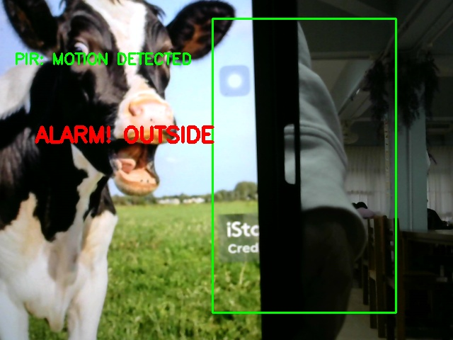
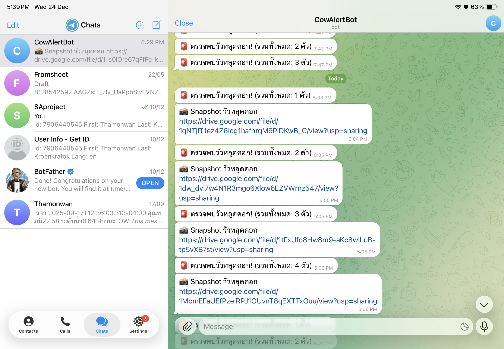

# รายงานโครงงานรายวิชา ENG23 3054 ระบบปฏิบัติการ
**หัวข้อโครงงาน (ภาษาไทย):**  ระบบแจ้งเตือนการหลบหนีของโคด้วย Raspberry Pi  
**หัวข้อโครงงาน (ภาษาอังกฤษ):** Raspberry Pi Cow Escape Aleart System

---

## 📋 ข้อมูลเบื้องต้น

| รายละเอียด | ข้อมูล |
| :--- | :--- |
| **รายวิชา** | ENG23 3054 ระบบปฏิบัติการ (Operating Systems) |
| **กลุ่มที่** | 11 |
| **กลุ่มเรียนที่** | 1 |
| **สาขาวิชา** | วิศวกรรมคอมพิวเตอร์ สำนักวิชาวิศวกรรมศาสตร์ |
| **สถาบัน** | มหาวิทยาลัยเทคโนโลยีสุรนารี |
| **ปีการศึกษา** | 2568 |

### 👥 คณะผู้จัดทำ

| ลำดับ | ชื่อ - สกุล | รหัสนักศึกษา |
| :---: | :--- | :--- |
| 1 | นางสาว วรัทยา  ปัตตะเน | B6600907 |
| 2 | นางสาว ธมนวรรณ  เกริ่นกระโทก | B6615406 |
| 3 | นาย ธีรภัทร  จันทะสุรีย์  | B6619404 |
| 4 | นางสาว นฤมล  ดีจะบก  | B6630652 |

---

## 📑 สารบัญ
1. [บทคัดย่อ (Abstract)](#บทคัดย่อ)
2. [วัตถุประสงค์ (Objectives)](#1-วัตถุประสงค์)
3. [ทฤษฎีที่เกี่ยวข้อง (Related Theories)](#2-ทฤษฎีที่เกี่ยวข้อง)
4. [การออกแบบ (System Design)](#3-การออกแบบ)
5. [ผลการดำเนินงาน (Results)](#4-ผลการดำเนินงาน)
6. [สรุปผลและข้อเสนอแนะ (Conclusion)](#5-สรุปผลการดำเนินงานและข้อเสนอแนะ)
7. [เอกสารอ้างอิง (References)](#เอกสารอ้างอิง)

---

## บทคัดย่อ
> *โครงงานนี้มีวัตถุประสงค์หลักเพื่อการศึกษาการทำงานของระบบตรวจจับสัตว์หลุดด้วยการใช้แบบจำลอง YOLO (You Only Look Once) โดยมุ่งเน้นการตรวจจับและระบุวัวที่หลุดออกจากพื้นที่ควบคุม พร้อมทั้งแจ้งเตือนเหตุการณ์การหลุดให้เจ้าของทราบทันที ซึ่งจะช่วยลดภาระการเฝ้าดูและเพิ่มประสิทธิภาพในการดูแลฟาร์มให้ดียิ่งขึ้น
ระบบจัดทำขึ้นโดยใช้บอร์ดสมองกลฝังตัว Raspberry Pi ทำงานร่วมกับกล้อง (Camera Module) และเซนเซอร์ตรวจจับความเคลื่อนไหว (PIR Sensor) หลักการทำงานจะเริ่มเมื่อเซนเซอร์ PIR ตรวจพบความเคลื่อนไหว ระบบจะสั่งการให้กล้องบันทึกภาพและนำไปสู่กระบวนการประมวลผลภาพ โดยใช้ Model YOLO ในการจำแนกวัตถุว่าเป็นวัวหรือไม่ หากตรวจพบว่าเป็นวัวที่กำลังหลุดออกจากพื้นที่ ระบบจะส่งสัญญาณเตือนผ่าน Buzzer และส่งข้อความพร้อมรูปภาพแจ้งเตือนไปยังเจ้าของผ่านแอปพลิเคชัน Telegram
ผลการทดลองพบว่า ระบบสามารถตรวจจับและระบุวัวได้อย่างถูกต้อง คิดเป็นร้อยละ เติมเอา และสามารถแจ้งเตือนเจ้าของได้ภายในเวลาเฉลี่ย วินาที วินาทีแสดงให้เห็นว่าระบบที่พัฒนาขึ้นสามารถช่วยลดความเสี่ยงในการสูญหายของสัตว์เลี้ยงและช่วยแบ่งเบาภาระของเกษตรกรได้อย่างมีประสิทธิภาพ*

---

## 1. วัตถุประสงค์
1.  การตรวจจับและระบุวัวที่หลุดออกจากพื้นที่ควบคุม
2.  แจ้งเตือนเหตุการณ์การหลุดของวัวเพื่อให้เจ้าของทราบ
3.  เพื่อช่วยลดภาระการเฝ้าดูและเพิ่มประสิทธิภาพในการดูแลฟาร์ม
4.  เพื่อศึกษาการทำงานของระบบตรวจจับสัตว์หลุด ด้วยการใช้ Model YOLO

## 2. ทฤษฎีที่เกี่ยวข้อง
> *ในการจัดทำโครงงานเรื่อง ระบบแจ้งเตือนการหลบหนีของโคด้วย Raspberry Pi คณะผู้จัดทำได้ศึกษาค้นคว้าทฤษฎี หลักการ และงานวิจัยที่เกี่ยวข้อง เพื่อเป็นแนวทางในการดำเนินงานและพัฒนาระบบ โดยแบ่งหัวข้อการศึกษาออกเป็นส่วนต่าง ๆ ดังนี้*

### 2.1 การประมวลผลภาพและคอมพิวเตอร์วิทัศน์ (Image Processing and Computer Vision)
หัวใจสำคัญของโครงงานนี้คือการทำให้ระบบสามารถ "มองเห็น" และ "เข้าใจ" ภาพที่ได้รับจากกล้อง ซึ่งอาศัยทฤษฎีดังนี้
*   **คอมพิวเตอร์วิทัศน์ (Computer Vision):** เป็นศาสตร์ที่ทำให้คอมพิวเตอร์สามารถตีความและทำความเข้าใจข้อมูลจากภาพหรือวิดีโอได้ ในโครงงานนี้คือการนำภาพจากกล้องมาวิเคราะห์เพื่อระบุว่ามี "วัว" อยู่ในภาพหรือไม่ และกำลังเคลื่อนที่ออกจากพื้นที่ที่กำหนดหรือไม่
*   **การตรวจจับวัตถุ (Object Detection):** เป็นเทคนิคในคอมพิวเตอร์วิทัศน์ที่ใช้สำหรับระบุตำแหน่งและประเภทของวัตถุภายในภาพ ระบบไม่เพียงแต่รู้ว่ามีวัวอยู่ แต่ยังสามารถวาดกรอบ (Bounding Box) รอบตัววัวได้
*   **อัลกอริทึม YOLO (You Only Look Once):** เป็นสถาปัตยกรรมโครงข่ายประสาทเทียม (Neural Network) ที่ได้รับความนิยมสูงในการตรวจจับวัตถุแบบ Real-time จุดเด่นคือความเร็วในการประมวลผล โดยโมเดลจะมองภาพเพียงครั้งเดียวเพื่อทำนายตำแหน่งและจำแนกประเภทของวัตถุทั้งหมดในภาพ ทำให้เหมาะกับการใช้งานบนอุปกรณ์ที่มีทรัพยากรจำกัดอย่าง Raspberry Pi
*   **โครงข่ายประสาทเทียมแบบคอนโวลูชัน (Convolutional Neural Networks - CNN):** เป็นรากฐานของโมเดล YOLO และโมเดลประมวลผลภาพสมัยใหม่ส่วนใหญ่ CNN ทำหน้าที่สกัดคุณลักษณะ (Feature Extraction) จากภาพ เช่น เส้นขอบ, รูปร่าง, หรือพื้นผิว เพื่อให้โมเดลสามารถเรียนรู้และจดจำลักษณะของวัตถุต่างๆ ได้

### 2.2 ระบบสมองกลฝังตัว (Embedded Systems) และฮาร์ดแวร์
*   **Raspberry Pi:** เป็นคอมพิวเตอร์บอร์ดเดี่ยว (Single-Board Computer) ที่มีความสามารถสูง สามารถรันระบบปฏิบัติการ Linux เต็มรูปแบบได้ ทำให้ง่ายต่อการพัฒนาและติดตั้งซอฟต์แวร์ต่างๆ มีพอร์ต GPIO (General-Purpose Input/Output) สำหรับเชื่อมต่อและควบคุมอุปกรณ์อิเล็กทรอนิกส์ภายนอก เช่น เซ็นเซอร์และโมดูลกล้อง ซึ่งเป็นหัวใจในการเชื่อมต่อฮาร์ดแวร์ของโครงงาน
*   **เซ็นเซอร์ PIR (Passive Infrared Sensor):** เป็นเซ็นเซอร์ที่ใช้วัดรังสีอินฟราเรดที่แพร่ออกมาจากวัตถุในขอบเขตการตรวจจับ โดยจะทำงานเมื่อมีการเปลี่ยนแปลงของระดับรังสีอย่างรวดเร็ว ซึ่งบ่งชี้ว่ามีสิ่งมีชีวิตที่มีอุณหภูมิร่างกายแตกต่างจากสภาพแวดล้อมเคลื่อนที่ผ่าน ใช้เป็นตัวกระตุ้น (Trigger) ให้ระบบเริ่มการทำงานถ่ายภาพ
*   **ระบบปฏิบัติการ (Operating System):** Raspberry Pi OS (เดิมชื่อ Raspbian) เป็นระบบปฏิบัติการที่พัฒนามาเพื่อ Raspberry Pi โดยเฉพาะ ทำหน้าที่เป็นตัวกลางระหว่างซอฟต์แวร์ (โค้ด Python, โมเดล YOLO) และฮาร์ดแวร์ (CPU, RAM, GPIO) จัดการโปรเซสและหน่วยความจำเพื่อให้ระบบทำงานได้อย่างราบรื่น

### 2.3 การสื่อสารและการแจ้งเตือน (Communication and Notification)
*   **Telegram Bot API:** เป็นบริการที่ช่วยให้นักพัฒนาสามารถสร้างโปรแกรม (Bot) เพื่อโต้ตอบกับผู้ใช้ผ่านแอปพลิเคชัน Telegram ได้ ในโครงงานนี้ใช้เพื่อส่งข้อความและรูปภาพแจ้งเตือนไปยังเจ้าของฟาร์มเมื่อระบบตรวจพบวัวหลบหนี โดยการทำงานจะอยู่บนโปรโตคอล HTTP ซึ่งเป็นการส่งคำขอไปยังเซิร์ฟเวอร์ของ Telegram เพื่อสั่งให้ Bot ทำงานตามที่ต้องการ

## 3. การออกแบบ
> *ส่วนนี้แสดงโครงสร้างระบบ (Architecture) หรือ Flowchart การทำงาน*

**แผนภาพกระบวนการทำงาน (System Flowchart)**

  
  [คลิกเพื่อดูรูปภาพ](https://drive.google.com/file/d/1eX5NxGCSTHvyUlY7Cmn07HVYJkJ80H8k/view?usp=drive_link)  
คำอธิบายรูปภาพ:  
ระบบจะเริ่มต้นทำงานเมื่อ เซ็นเซอร์ตรวจจับความเคลื่อนไหว (PIR Sensor) พบการเคลื่อนไหวในพื้นที่ที่กำหนด จากนั้นระบบจะสั่งให้ โมดูลกล้อง (Camera Module) ถ่ายภาพวัตถุที่เคลื่อนไหวนั้น

  ภาพที่ได้จะถูกส่งไปเข้าสู่กระบวนการ ประมวลผลภาพ (Image Processing) โดยใช้ โมเดล YOLO เพื่อวิเคราะห์และจำแนกวัตถุในภาพ

  หากโมเดลตรวจพบว่าวัตถุนั้นคือ "วัว" ที่กำลังหลบหนีออกจากพื้นที่ควบคุม ระบบจะทำการแจ้งเตือน 2 ส่วนพร้อมกัน คือ:
   1. ส่งเสียงเตือน: เปิดใช้งาน Buzzer เพื่อส่งเสียงแจ้งเตือนในบริเวณนั้นทันที
   2. ส่งการแจ้งเตือนระยะไกล: ส่ง ข้อความและรูปภาพ ของเหตุการณ์ที่เกิดขึ้นไปยังเจ้าของผ่านทาง แอปพลิเคชัน Telegram

  กระบวนการทั้งหมดนี้ทำงานอัตโนมัติเพื่อให้เจ้าของสามารถรับทราบและจัดการสถานการณ์ได้อย่างรวดเร็ว*

## 4. ผลการดำเนินงาน

* **ผลลัพธ์ที่ 1: การตรวจจับและเฝ้าระวังภายในพื้นที่ (Normal Monitoring)**
    *   คำอธิบาย: ภาพหน้าจอแสดงการทำงานของระบบในภาวะปกติ โมเดล YOLO สามารถตรวจจับและจำแนกวัว (Cow) ภายในเฟรมภาพได้อย่างถูกต้อง โดยแสดงกรอบสี่เหลี่ยม (Bounding Box) สีเขียวล้อมรอบตัววัวระบบสามารถคำนวณพิกัดและตรวจสอบได้ว่าวัวยังคงอยู่ภายในเส้นขอบเขต (Polygon) ที่กำหนดไว้
  
    
  [คลิกเพื่อดูรูปภาพ](https://drive.google.com/file/d/1-W66SP7VeAnbhWToNqjbBjC6p66_Aupq/view?usp=drive_link)
 

* **ผลลัพธ์ที่ 2: การแจ้งเตือนเมื่อวัวหลุดออกจากพื้นที่ (Escape Alert & Telegram Notification)**
    *   คำอธิบาย: เมื่อระบบตรวจพบว่าพิกัดของวัวเคลื่อนที่ออกนอกขอบเขตที่กำหนด ระบบจะเปลี่ยนสถานะเป็น "ALARM! OUTSIDE" และเปลี่ยนสีกรอบเป็นสีแดงทันที พร้อมส่งเสียงเตือนผ่าน Buzzer ในขณะเดียวกัน ระบบได้ทำการอัปโหลดภาพเหตุการณ์ไปยัง Google Drive และส่งข้อความแจ้งเตือนพร้อมลิงก์รูปภาพไปยังแอปพลิเคชัน Telegram ของเจ้าของได้สำเร็จ ดังภาพตัวอย่างการแจ้งเตือน
  
     
   [คลิกเพื่อดูรูปภาพ](https://drive.google.com/file/d/1T1ZwwsV-GJTrP_yZ5dr03irUhn6QuIwQ/view?usp=drive_link)

## 5. สรุปผลการดำเนินงานและข้อเสนอแนะ

### 5.1 สรุปผลการดำเนินงาน
จากการดำเนินโครงงาน "ระบบแจ้งเตือนการหลบหนีของโคด้วย Raspberry Pi" สามารถสรุปผลการดำเนินงานตามวัตถุประสงค์ได้ดังนี้:

1. **ด้านการตรวจจับและจำแนก:** ระบบสามารถผสานการทำงานระหว่างฮาร์ดแวร์ (PIR Sensor) และซอฟต์แวร์ (YOLOv8) ได้อย่างมีประสิทธิภาพ โดยเซ็นเซอร์ PIR ช่วยลดภาระการประมวลผลของ CPU โดยจะกระตุ้นให้ระบบรันโมเดลเมื่อมีการเคลื่อนไหวเท่านั้น และโมเดล YOLOv8 สามารถจำแนกวัวออกจากวัตถุอื่นได้อย่างแม่นยำ
2. **ด้านการเฝ้าระวังพื้นที่:** ระบบสามารถกำหนดขอบเขตพื้นที่ควบคุม (Virtual Fence) ในรูปแบบ Polygon และตรวจสอบความสัมพันธ์ระหว่างตำแหน่งพิกัดของวัวกับขอบเขตที่กำหนดได้แบบ Real-time ทำให้สามารถระบุสภาวะ "หลุดคอก" ได้อย่างถูกต้อง
3. **ด้านการแจ้งเตือน:** ระบบสามารถแจ้งเตือนผ่านสองช่องทางหลัก คือ สัญญาณเสียง (Buzzer) สำหรับการเตือนในพื้นที่ และการส่งข้อความแจ้งเตือนพร้อมลิงก์รูปภาพผ่าน Telegram API ซึ่งช่วยให้เจ้าของรับทราบเหตุการณ์ได้ทันทีจากระยะไกล

**สรุปภาพรวม:** โครงงานนี้บรรลุวัตถุประสงค์ในการสร้างระบบเฝ้าระวังอัตโนมัติที่ช่วยลดภาระการเฝ้าดู เพิ่มความปลอดภัยให้กับสัตว์เลี้ยง และเป็นต้นแบบในการนำเทคโนโลยี AI และ IoT มาประยุกต์ใช้ในงานด้านเกษตรกรรมได้อย่างมีประสิทธิภาพ

### 5.2 ปัญหาและข้อเสนอแนะ
* **ปัญหาที่พบ:**
    1. **ปัญหาด้านแสงสว่างและสภาพแวดล้อม:** ประสิทธิภาพการตรวจจับลดลงในเวลากลางคืนหรือแสงน้อย เนื่องจากข้อจำกัดของกล้อง และเซ็นเซอร์ PIR อาจแจ้งเตือนผิดพลาดจากสภาพอากาศ
    2. **ความล่าช้าของเครือข่าย:** กระบวนการอัปโหลดรูปภาพขึ้น Google Drive ก่อนส่งแจ้งเตือนอาจทำให้เกิดความล่าช้า (Delay) หากสัญญาณอินเทอร์เน็ตไม่เสถียร
    3. **ความร้อนสะสม:** การรันโมเดล YOLO ตลอดเวลาบน Raspberry Pi ทำให้เกิดความร้อนสูง ซึ่งอาจส่งผลต่อประสิทธิภาพในระยะยาว

* **ข้อเสนอแนะ:**
    1. **ปรับปรุงฮาร์ดแวร์:** ควรใช้กล้องอินฟราเรด (Night Vision) หรือติดตั้งไฟส่องสว่างอัตโนมัติเพื่อให้ทำงานได้ตลอด 24 ชั่วโมง
    2. **ระบบสำรองข้อมูล:** เพิ่มฟังก์ชัน Offline Mode บันทึกข้อมูลลง SD Card เมื่ออินเทอร์เน็ตหลุด และส่งข้อมูลย้อนหลังเมื่อกลับมาออนไลน์
    3. **การจัดการความร้อน:** ติดตั้งพัดลมระบายความร้อน (Cooling Fan) ให้กับอุปกรณ์เพื่อการทำงานที่เสถียรยิ่งขึ้น
---

## เอกสารอ้างอิง

1.  Ultralytics. (2023). *Ultralytics YOLOv8 Docs*. สืบค้นเมื่อ 24 ธันวาคม 2568, จาก https://docs.ultralytics.com/
2.  Raspberry Pi Foundation. (n.d.). *Raspberry Pi Documentation*. สืบค้นเมื่อ 24 ธันวาคม 2568, จาก https://www.raspberrypi.org/documentation/
3.  OpenCV Team. (2023). *OpenCV-Python Tutorials*. สืบค้นเมื่อ 24 ธันวาคม 2568, จาก https://docs.opencv.org/4.x/d6/d00/tutorial_py_root.html
4.  Telegram. (n.d.). *Telegram Bot API*. สืบค้นเมื่อ 24 ธันวาคม 2568, จาก https://core.telegram.org/bots/api
5.  Redmon, J., Divvala, S., Girshick, R., & Farhadi, A. (2016). *You Only Look Once: Unified, Real-Time Object Detection*. In Proceedings of the IEEE conference on computer vision and pattern recognition (pp. 779-788).